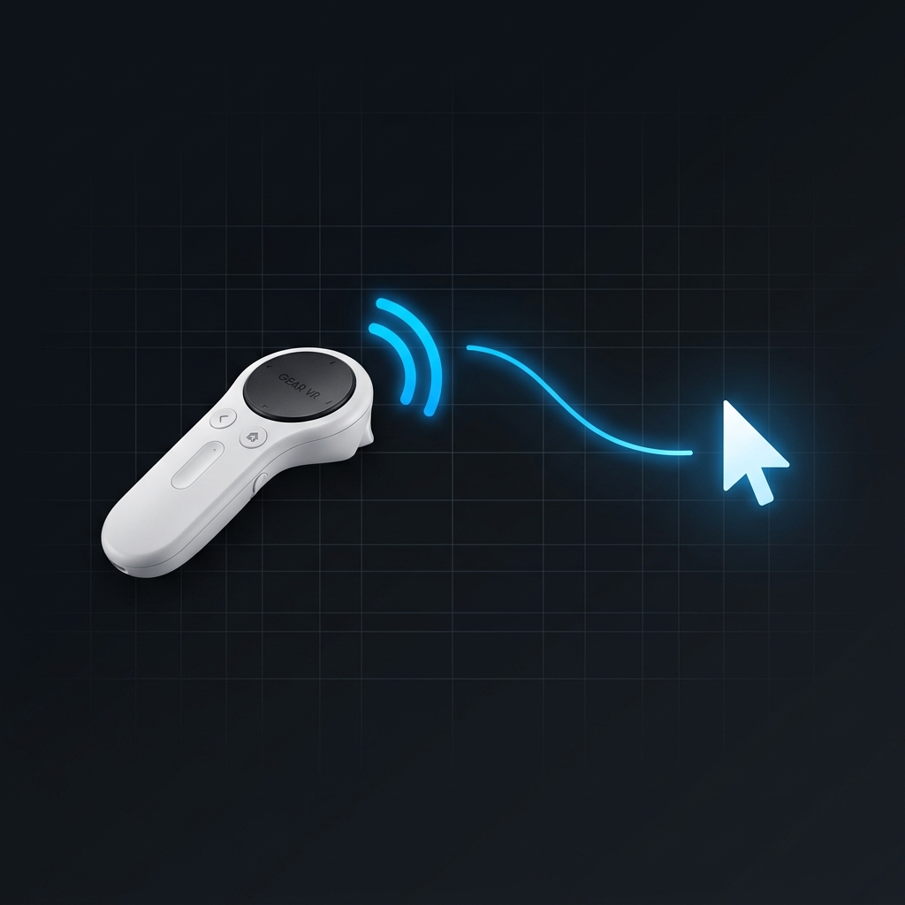

<p align="center">
  
</p>

# Gear VR Controller → Mouse

Use a **Samsung Gear VR Controller** (SM-R322 / SM-R325) as a wireless mouse on Windows via Bluetooth Low Energy.

The controller's gyroscope data is translated into cursor movement, and the trigger button acts as a left mouse click.

## Features

- **Gyroscope → Mouse Movement** — tilt the controller to move the cursor
- **Trigger → Left Click** — with debounce protection
- **Auto-Reconnect** — seamless reconnection when the BLE link drops (~0.5s recovery)
- **Battery Level Readout** — displayed on first connection
- **Aggressive Keep-Alive** — prevents the controller from entering sleep mode
- **Diagnostics Logging** — periodic packet rate stats for monitoring connection health

## Requirements

- **OS:** Windows 10/11 (uses `ctypes` + `user32.dll` for mouse input)
- **Python:** 3.10+
- **Bluetooth:** BLE-capable adapter
- **Hardware:** Samsung Gear VR Controller

## Installation

```bash
git clone https://github.com/szympik/gear-vr-controller-mouse.git
cd gear-vr-controller-mouse

python -m venv .venv
.venv\Scripts\activate

pip install -r requirements.txt
```

## Configuration

Open `main.py` and set your controller's MAC address:

```python
MAC_ADDRESS = "XX:XX:XX:XX:XX:XX"  # Replace with your controller's MAC
```

To find your controller's MAC address, pair it with Windows first, then run:

```bash
python tools/scanner.py
```

### Tuning Parameters

| Parameter     | Default | Description                                           |
|---------------|---------|-------------------------------------------------------|
| `SENSITIVITY` | `150.0` | Higher = slower cursor movement                       |
| `DEADZONE`    | `50`    | Minimum gyro value to register movement               |
| `HEARTBEAT_INTERVAL` | `0.1` | Seconds between keep-alive signals              |

## Usage

```bash
python main.py
```

The program will:
1. Scan for the controller by MAC address
2. Connect and read battery level
3. Start streaming gyroscope data → mouse movement
4. Auto-reconnect if the connection drops

Press `Ctrl+C` to exit.

## Project Structure

```
gear-vr-controller-mouse/
├── main.py              # Main application — mouse control + auto-reconnect
├── tools/
│   ├── scanner.py       # Discover nearby BLE devices
│   ├── gatt_explorer.py # List GATT services/characteristics of a device
│   └── test_buttons.py  # Test and decode controller button presses
├── requirements.txt
├── LICENSE
├── .gitignore
└── README.md
```

## How It Works

The Gear VR Controller communicates over BLE using custom GATT characteristics (reverse-engineered UUIDs). The controller sends 60-byte notification packets containing:

- **Bytes 10–15**: Gyroscope data (X, Y, Z as signed 16-bit little-endian)
- **Byte 58**: Button states (trigger, home, back, touchpad, volume)

The main loop:
1. Subscribes to BLE notifications from the controller
2. Decodes gyroscope data and maps it to relative mouse movement via Windows API (`mouse_event`)
3. Detects trigger press (rising edge) and fires a mouse click
4. Runs a heartbeat task that repeatedly sends `CMD_LPM_DISABLE + CMD_SENSOR + CMD_KEEP_ALIVE` to prevent the controller from sleeping

### Known Limitations

- The BLE connection may drop every ~14 seconds due to controller/adapter firmware behavior. The auto-reconnect loop handles this transparently.
- Windows-only (relies on `ctypes.windll.user32` for mouse control).

## Tools

### `tools/scanner.py`
Scans for all nearby BLE devices. Useful for finding your controller's MAC address.

```bash
python tools/scanner.py
```

### `tools/gatt_explorer.py`
Lists all GATT services and characteristics of a BLE device.

```bash
python tools/gatt_explorer.py XX:XX:XX:XX:XX:XX
```

### `tools/test_buttons.py`
Connects to the controller and prints button states in real-time.

```bash
python tools/test_buttons.py XX:XX:XX:XX:XX:XX
```

## License

[MIT](LICENSE)

## Acknowledgments

- Controller protocol based on reverse-engineering work from the [gearern/gearern](https://github.com/jsyang/geern) community
- BLE communication powered by [bleak](https://github.com/hbldh/bleak)
